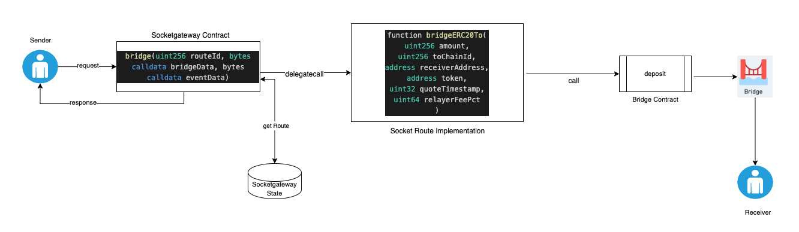
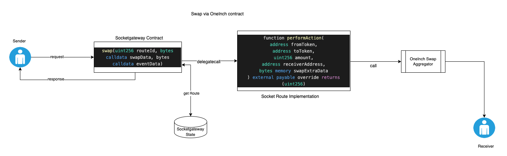
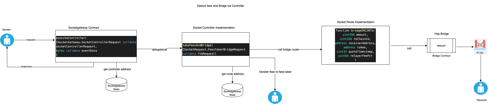

# socket-ll-contracts

[![Foundry][foundry-badge]][foundry]

[foundry]: https://getfoundry.sh/
[foundry-badge]: https://img.shields.io/badge/Built%20with-Foundry-FFDB1C.svg


The smart contracts that power the liquidity Layer of [Socket](https://socket.tech/). 
Socket-ll will abstract the bridges and facilitate the cross-chain bridge and swap

## Architecture

- Socket smart contracts are aggregators of DEXs, DEX aggregators & bridges. The key highlight of Socket’s smart contract architecture is that we choose modularity over upgradability. Once a module is deployed it can only be disabled by the owner, everything is immutable.

- Users interact with Socket’s Socketgateway.sol contract to initiate a bridging, swap or other complex interactions.

- This contract delegates to modules called routes. These are deployed as different contracts and tracked using routeIds.

- Bridge and Swap routes have logic for interacting with bridges and dexes.

- Controller routes have other flows apart from direct bridge/dex interactions.

- Initial set of 512 routes get predetermined and get hardcoded in SocketGateway for gas savings.

- These are deployed using SocketDeployFactory.

- SocketDeployFactory is also able to destroy these and deploy a disabled contract in place of original route.

- More routes can be added directly to SocketGateway via normal deployment and can be disabled by setting their address to 0.

- In both forms, routes can be added against a routeId only once. After this the routeId can only be disabled if needed.

- The system allows for routeId based whitelisting to be configured by integrators to achieve their desired security.

## Security Assumptions

- The contracts are build for routing funds over existing bridge/dex contracts.

- The contracts are not supposed to hold any funds post tx execution.

- An exception to this is the feesTakerAddress supplied to FeesTakerController.

- Factory, create2 and selfdestruct based approach is used to predetermine a set of contracts which can be hardcoded on Gateway.

- Another approach to store and use contract addresses from the storage of Gateway contract is also in place.

- We fallback to this approach when selfdestruct is deprecated. All of the routes controlled by Factory will be destroyed and disabled at when this happens.

### Bridge



### Swap



### Controller




## Local Development

### Prereqs

- Foundry
- typescript
- Yarn
- hardhat 

### environment

- create .env file under root directory
- refer to .env.example file for all keys in .env

### Setup

Clone project and install dependencies.

```bash=
# clone the repository
git clone https://github.com/SocketDotTech/socket-ll-contracts

# move to repository folder
cd socket-ll-contracts

# install node modules
yarn install

# install forge dependencies
forge install
```

### Submodules

Submodules imported:
- [`solmate`](https://github.com/transmissions11/solmate) (for contracts)
- [`openzeppelin-contracts`](https://github.com/Openzeppelin/openzeppelin-contracts)
- [`forge-std`](https://github.com/foundry-rs/forge-std) (for testing)

Versions of dependencies can be checked with `git submodule status`.


### Foundry dependency verification

- Essential dependencies foundry library are:

1. forge-std
2. solmate
3. openzeppelin-contracts
4. ds-test

- These dependency config is added to remappings.txt under root directory

- If you would like to manually install the dependencies, then use commands:

```sh
forge install transmissions11/solmate
```

```sh
forge install Openzeppelin/openzeppelin-contracts
```

```sh
forge install forge-std
```

```sh
forge install ds-test
```

### Project Layout

```
├── lib
│   └── ds-test - forge dependencies installed as git submodules
│   └── forge-std - forge dependencies installed as git submodules
│   └── openzeppelin-contracts - forge dependencies installed as git submodules
│   └── solmate - forge dependencies installed as git submodules
|
├── src
│     └── bridges - all bridge implementation contracts
│     └── controllers - all controller implementation contracts
│     └── deployFactory - Contracts to control code at predetermined route addresses
│     └── errors - errors used in reverts
│     └── interfaces - interface contracts with requests for bridges, swaps and controllers
│     └── libraries - libraries used for byte operations
│     └── static - static data used in contracts
│     └── swap - all swap implementation contracts
│     └── utils - Helper utils used in other contracts
|
└── test
|   └── solidity
|       └── bridges - tests for bridge routes
|       └── controllers - tests for controller contracts
|       └── ownership - tests for ownership management of contracts
|       └── rescue-funds - tests for rescue-fund functions
|       └── routes - tests for route management functions
|       └── swap - tests for swap routes
|       └── swap-bridge - tests for swap-and-bridge function
|       └── SokcetGatewayBaseTest.sol - Base contract inherited by all tests
|
└── Files for project setup
```

### Lint

Linter is run automatically before each commit.
It can also be triggered manually using yarn lint script.

```bash=
yarn lint
```

### Test

Tests are run using the [Forge](https://github.com/foundry-rs/foundry/tree/master/forge) tool of [Foundry](https://github.com/foundry-rs/foundry).

```bash=
forge test
```


### IDE Setup

It is recommended to setup the ide to work with solidity development. In case of VSCode, [Solidity](https://marketplace.visualstudio.com/items?itemName=JuanBlanco.solidity) and [Prettier](https://marketplace.visualstudio.com/items?itemName=esbenp.prettier-vscode) plugins should work best when configured using following settings -

```json=
{
    "solidity.compileUsingRemoteVersion": "v0.8.15+commit.e14f2714",
    "solidity.packageDefaultDependenciesContractsDirectory": "src",
    "solidity.packageDefaultDependenciesDirectory": "lib",
    "editor.formatOnSave": true,
    "[solidity]": {
        "editor.tabSize": 4,
        "editor.defaultFormatter": "esbenp.prettier-vscode"
    },
    "solidity.remappings": [
        "forge-std/=lib/forge-std/src/",
        "ds-test/=lib/ds-test/src/",
        "solmate/=lib/solmate/src/",
        "openzeppelin-contracts/=lib/openzeppelin-contracts/src/"
    ],
}
```


